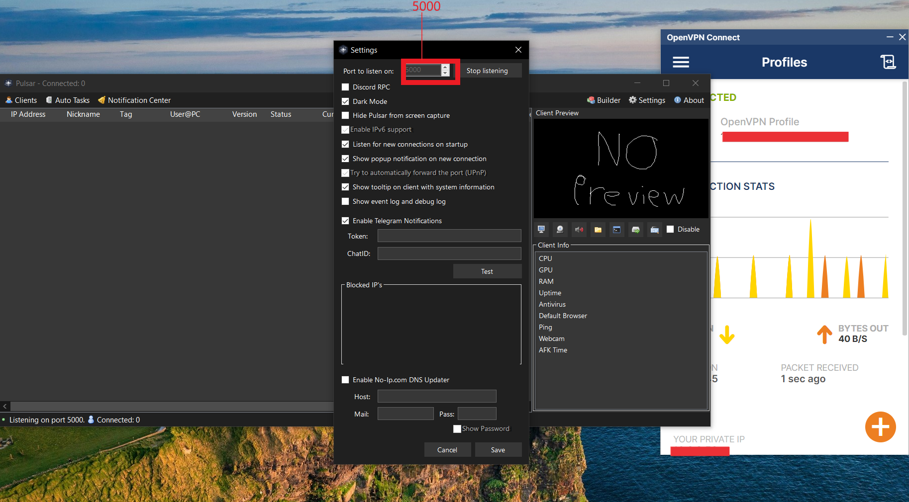

# Pulsar Setup Guide with Portmap

Uh... Hello to whoever is reading this.  
This is basically a complete **A–Z guide** on how to set up a remote access tool using [Portmap.io](https://portmap.io).  
For this guide I'll be using **Pulsar** as a demonstration (you can grab it from [this repo](https://github.com/XCandlemassX/Pulsar)).

So let’s get into it.  
Head over to [portmap.io](https://portmap.io).

As seen in the image, click on the **SIGN-IN** button.  

Then on this page you’ll be creating your Portmap account just like any other site — nothing special.  

After creating your account, verify your email, and that’s basically it for creating a Portmap account.  
Also I haven’t said this but the reason we’re creating a Portmap account is because we’re going to use it as a **port forwarding service**. If you don’t know what that is go search it up or ask ChatGPT.  

---

## Step 2: Configurations
Go to the **Configurations** page → create a new config.  

You’ll get an auto-generated file with a bunch of random text (encrypted stuff).  
Most importantly: **DOWNLOAD IT**. There’s a download button there, click it and save the file.  

On the left-sidebar you’ll see a link to download **OpenVPN**. (OpenVPN is basically just a relay service to connect you to Portmap, hope you understood that.)  

👉 Direct download link: [OpenVPN 2.6.14 64-bit](https://swupdate.openvpn.org/community/releases/OpenVPN-2.6.14-I004-amd64.msi)  
(You can of course still visit the site — no difference.)  

  

---

## Step 3: Mappings
Head over to the **Mappings** tab in portmap.io → create a new config.  
Leave the auto-filled defaults intact. Do **not** change anything that was already filled up.  

  
  

Leave the input field that says **Port on Portmap.io** (mine is `42198`). Yours will most definitely be different — but that doesn’t mean you should change it.  

The only thing you need to fill in is the field that says **Port on your PC** → set it to **5000**.  
(Five thousand. Don’t you go putting 500 or 50000. It’s **FIVE THOUSAND — three 0’s after the five** if you don’t know.)  

Then click on the **Create** button. Leave the **Allowed IPs** field blank — don’t touch it.

---

## Step 4: Windows Firewall Config
On your PC, search for:  
`Windows Defender Firewall with Advanced Security`  

⚠️ **NOT** just “Windows Defender Firewall”.  
Ensure the exact name has *with advanced security*, like in the image.  

Once opened, on the left sidebar go to **Inbound Rules** (not Outbound rules — you ain’t got business with outbound rules).  

Then on the right click on **New Rule**.  
  

Set the rule type as **Port** (not Program or anything else).  

Make sure it’s set to **TCP** and the port number is **5000** (the same one you set in Portmap).  

Click **Next, Next...** then give the port rule any name you want (doesn’t affect anything).  

After you’re done, just close it (if you wanna — doesn’t matter).

---

## Step 5: Disable Windows Firewall
Open **Control Panel** → **System and Security**.  

Click on **Windows Defender Firewall**.  

On the sidebar you’ll see a bunch of options. Click on **Turn Windows Defender Firewall on or off**.  

Then disable both options (turn them off).  

---

## Step 6: Pulsar Setup
Now open Pulsar — the elephant in the room… wait did I say elephant? Sorry, I meant RAT lol. 🐀 

Head over to the **Settings** tab → in the Port field set it to **5000**.  
Then click **Start Listening for Connections** and **Save**.  

Now open **OpenVPN** (the one we downloaded earlier).  
👉 [Download link again for convenience](https://swupdate.openvpn.org/community/releases/OpenVPN-2.6.14-I004-amd64.msi)  

Then drag and drop the config file you downloaded from Portmap earlier (told ya it’d be important).

---

## Step 7: Build Client
In the **Builder** tab of Pulsar → go to **Connections**.  
Fill it in with the address you got from Portmap.  

⚠️ Important: Do **NOT** copy the `tcp://` prefix — that’s not part of the connection string.  

Paste the address into Pulsar and click **Add Host**.  
  

After filling those up, feel free to adjust any other settings in the Builder tab as you want.  
Then click **Build Client**.

---

## 🎉 Done!
That’s all, fellas — no sections skipped.  
Everything from **A–Z** on how to set up Pulsar using Portmap.  

If you found this guide helpful, please ⭐ the repo:  
👉 [Pulsar on GitHub](https://github.com/XCandlemassX/Pulsar) 🙏🙏  

---

## 📬 Contact
For feedback, questions, or just to say thanks, reach me on Telegram:  
[@XCandlemass](https://t.me/XCandlemass)

